### EIP-3.0 Phase-II Final Assignment

This repository is the implementation of Age GAN in Keras Framework on UTKFace dataset. Dataset you can get it here: http://aicip.eecs.utk.edu/wiki/UTKFace

I trained the Cycle GAN for Age Progression, i divided the dataset for training, dataA for the age between 65 to 85 & dataB for the age 25 to 35. I made the dataset in different sizes 32, 64 and 128 & saved in Numpy Compressed format for training purpose. You can check in "data_prep.ipynb" notebook.

I trained with 64 & 128 size and got different kind of results. I trained for around 100 epochs & saved some training pics also & stopped when Discriminator loss became 0. 

Here are some of the observations i got during training & inference.

## Image Conversions during Training

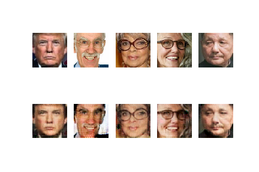

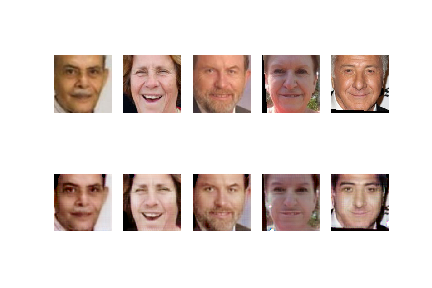

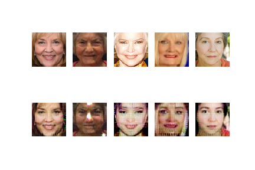

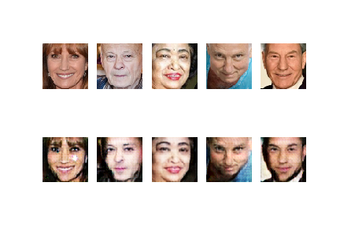

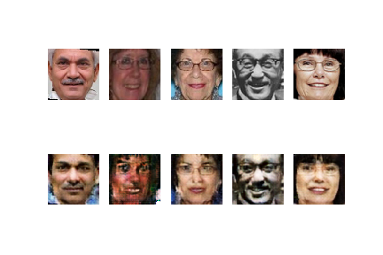

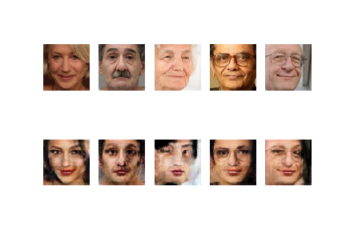

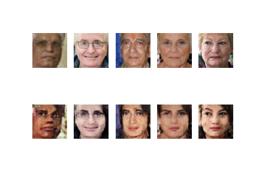

## Image Conversions during Inference

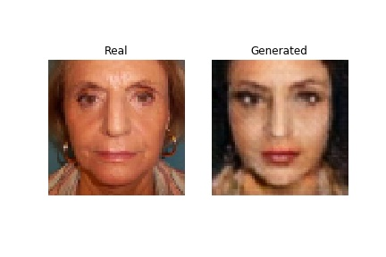

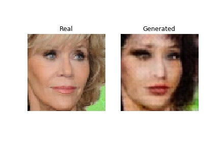

.jpg)

.jpg)

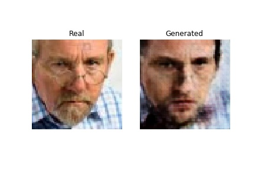

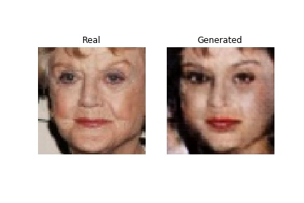

.jpg)

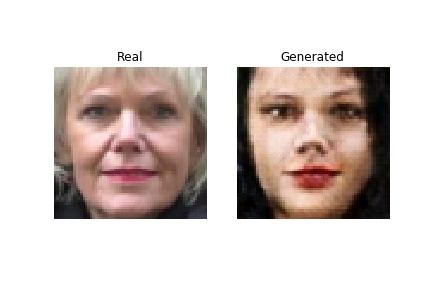

You can check the training process for 64*64 size images in "model_64.ipynb" file and for inference  you can check the "inference.ipynb" file. 